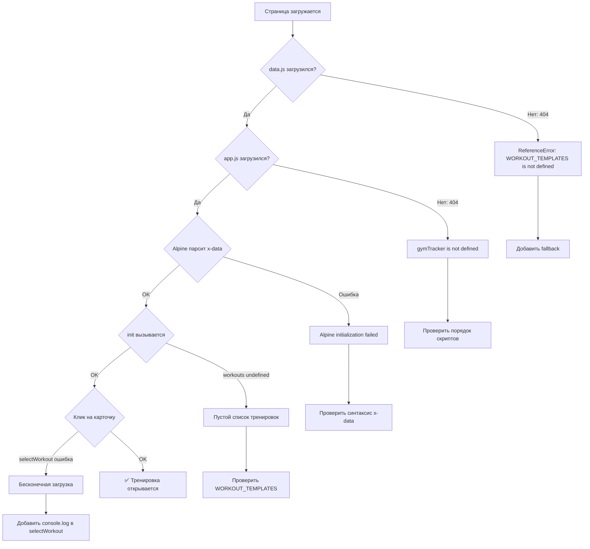
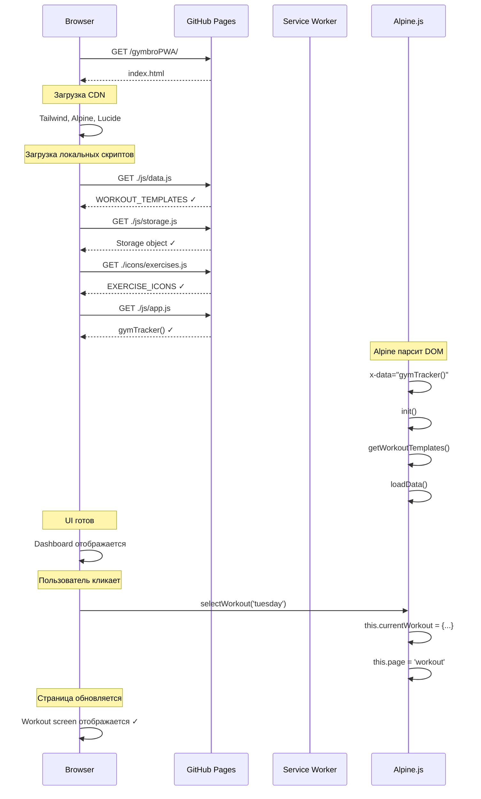

# 🔄 GymBro PWA — Data Flow & Troubleshooting Guide

> Архитектура загрузки, поток данных и план исправлений

---

## 📋 Оглавление

1. [Архитектура загрузки](#архитектура-загрузки)
2. [Поток данных](#поток-данных)
3. [Позитивные сценарии](#позитивные-сценарии)
4. [Диагностика проблем](#диагностика-проблем)
5. [План исправлений](#план-исправлений)
6. [Чеклист деплоя](#чеклист-деплоя)

---

## 🏗 Архитектура загрузки

### Порядок загрузки скриптов

```
┌─────────────────────────────────────────────────────────────┐
│                        index.html                            │
├─────────────────────────────────────────────────────────────┤
│  <head>                                                      │
│    ├── Tailwind CDN (async)                                  │
│    ├── Alpine.js (defer)                                     │
│    └── Lucide Icons                                          │
│  </head>                                                     │
│                                                              │
│  <body x-data="gymTracker()">                                │
│    └── ... HTML контент ...                                  │
│                                                              │
│    <!-- КРИТИЧНО: Порядок скриптов! -->                      │
│    <script src="js/data.js"></script>      ← 1. Данные       │
│    <script src="js/storage.js"></script>   ← 2. Storage API  │
│    <script src="icons/exercises.js"></script> ← 3. SVG иконки│
│    <script src="js/app.js"></script>       ← 4. Alpine логика│
│  </body>                                                     │
└─────────────────────────────────────────────────────────────┘
```

### Диаграмма последовательности загрузки

```
Browser                 Server              Alpine.js
   │                       │                    │
   │──GET index.html──────►│                    │
   │◄─────HTML─────────────│                    │
   │                       │                    │
   │──GET Tailwind CDN────►│                    │
   │──GET Alpine.js───────►│ (defer)            │
   │──GET Lucide──────────►│                    │
   │                       │                    │
   │◄────Scripts loaded────│                    │
   │                       │                    │
   │──GET js/data.js──────►│                    │
   │◄──WORKOUT_TEMPLATES───│                    │
   │                       │                    │
   │──GET js/storage.js───►│                    │
   │◄──Storage object──────│                    │
   │                       │                    │
   │──GET icons/exercises.js►│                  │
   │◄──EXERCISE_ICONS──────│                    │
   │                       │                    │
   │──GET js/app.js───────►│                    │
   │◄──gymTracker()────────│                    │
   │                       │                    │
   │                       │    Alpine parses   │
   │                       │    x-data="gymTracker()"
   │                       │         │          │
   │                       │         ▼          │
   │                       │    gymTracker()────►│
   │                       │         │          │
   │                       │    init()◄─────────│
   │                       │         │          │
   │                       │    loadData()      │
   │                       │    calculateHRZones()
   │                       │         │          │
   │                       │         ▼          │
   │◄───────────Reactive DOM Updated───────────│
   │                       │                    │
```

### Зависимости между файлами

```
┌──────────────┐
│   data.js    │ ← Глобальная переменная WORKOUT_TEMPLATES
└──────┬───────┘
       │ зависит от
       ▼
┌──────────────┐
│  storage.js  │ ← Глобальный объект Storage
└──────┬───────┘
       │ зависит от
       ▼
┌──────────────┐
│ exercises.js │ ← Глобальная переменная EXERCISE_ICONS
└──────┬───────┘
       │ зависит от
       ▼
┌──────────────┐
│   app.js     │ ← Использует ВСЕ вышеуказанные
│              │
│ gymTracker() │
│   ├── workouts: WORKOUT_TEMPLATES
│   ├── Storage.getWorkouts()
│   └── EXERCISE_ICONS[name]
└──────────────┘
```

---

## 🔄 Поток данных

### State Management

```
┌─────────────────────────────────────────────────────────────┐
│                     Alpine.js State                          │
├─────────────────────────────────────────────────────────────┤
│                                                              │
│  gymTracker() {                                              │
│    return {                                                  │
│      // ═══════ NAVIGATION ═══════                          │
│      page: 'dashboard',     ← Текущая страница              │
│                                                              │
│      // ═══════ USER DATA ═══════                           │
│      profile: {                                              │
│        name, age, maxHR, fatBurnLow, fatBurnHigh...         │
│      },                                                      │
│                                                              │
│      // ═══════ WORKOUT DATA ═══════                        │
│      workouts: WORKOUT_TEMPLATES,  ← Шаблоны (static)       │
│      currentWorkout: null,         ← Текущая тренировка     │
│      currentExerciseIndex: 0,      ← Индекс упражнения      │
│                                                              │
│      // ═══════ EXERCISE STATE ═══════                      │
│      sets: [],              ← Записанные подходы            │
│      currentWeight: 20,     ← Текущий вес                   │
│      currentReps: 12,       ← Текущие повторения            │
│      selectedAlt: null,     ← Выбранная альтернатива        │
│                                                              │
│      // ═══════ CARDIO ═══════                              │
│      cardioData: { type, duration, podcast },               │
│                                                              │
│      // ═══════ COMPLETION ═══════                          │
│      moodPost: 7,           ← Настроение после              │
│      moodDay: 7,            ← Настроение за день            │
│      notes: '',             ← Заметки                       │
│                                                              │
│      // ═══════ STATS ═══════                               │
│      stats: { streak, weekCompleted, cardioMinutes... },    │
│      recentWorkouts: [],    ← Последние 5 тренировок        │
│    }                                                         │
│  }                                                           │
└─────────────────────────────────────────────────────────────┘
```

### Data Flow: Запись тренировки

```
┌──────────┐    ┌──────────┐    ┌──────────┐    ┌──────────┐
│Dashboard │───►│ Select   │───►│ Workout  │───►│ Cardio   │
│          │    │ Workout  │    │ Exercise │    │          │
└──────────┘    └──────────┘    └──────────┘    └──────────┘
                     │               │               │
                     ▼               ▼               ▼
              selectWorkout()  recordSet()    cardioData
                     │               │               │
                     ▼               ▼               ▼
              currentWorkout    sets.push()   { type, duration }
              currentExerciseIndex              │
                                               │
                                               ▼
                                        ┌──────────┐
                                        │ Complete │
                                        │          │
                                        └────┬─────┘
                                             │
                                             ▼
                                       saveWorkout()
                                             │
                                             ▼
                                    ┌─────────────────┐
                                    │  localStorage   │
                                    │                 │
                                    │ gym_workouts    │
                                    │ gym_stats       │
                                    └─────────────────┘
```

### localStorage Schema

```javascript
// gym_workouts - массив тренировок
[
  {
    id: 1706968800000,          // timestamp
    date: "03.02",              // для отображения
    dateISO: "2024-02-03T...",  // для сортировки
    type: "tuesday",            // ключ из WORKOUT_TEMPLATES
    name: "Upper Body",
    sets: [
      { exerciseIndex: 0, exerciseId: "lat_pulldown", weight: 45, reps: 12 },
      { exerciseIndex: 0, exerciseId: "lat_pulldown", weight: 45, reps: 10 },
      // ...
    ],
    cardio: { type: "treadmill", duration: 30, podcast: "" },
    moodPost: 8,
    moodDay: 7,
    notes: ""
  },
  // ...
]

// gym_stats - статистика
{
  streak: 12,
  weekCompleted: 5,
  weekTotal: 7,
  cardioMinutes: 245,
  avgMood: 7.8
}
```

---

## ✅ Позитивные сценарии

### Сценарий 1: Полная тренировка (Happy Path)

```
┌─────────────────────────────────────────────────────────────┐
│ СЦЕНАРИЙ: Николай выполняет тренировку Upper Body           │
├─────────────────────────────────────────────────────────────┤
│                                                              │
│ 1. Открывает приложение                                      │
│    └─► Dashboard загружается                                 │
│    └─► Видит стрик: 12 дней                                  │
│    └─► Видит прогресс недели: 5/7                            │
│                                                              │
│ 2. Нажимает "Начать тренировку"                              │
│    └─► page = 'select-workout'                               │
│    └─► Видит 4 карточки тренировок                           │
│                                                              │
│ 3. Выбирает "Upper Body" 💪                                   │
│    └─► selectWorkout('tuesday')                              │
│    └─► currentWorkout = WORKOUT_TEMPLATES.tuesday            │
│    └─► currentExerciseIndex = 0                              │
│    └─► page = 'workout'                                      │
│                                                              │
│ 4. Выполняет упражнение "Тяга верхнего блока"                │
│    └─► Видит: 3×12, прошлый раз: 45 кг                       │
│    └─► Устанавливает вес: 47.5 кг (кнопки +/-)               │
│    └─► Устанавливает повторы: 12                             │
│    └─► Нажимает "Записать подход"                            │
│    └─► recordSet() → sets.push({...})                        │
│    └─► Видит бейдж: "47.5 кг × 12"                           │
│    └─► Повторяет ещё 2 раза                                  │
│                                                              │
│ 5. После 3 сетов → автопереход к следующему упражнению       │
│    └─► currentExerciseIndex = 1                              │
│    └─► Загружается "Жим гантелей от плеч"                    │
│    └─► currentWeight = lastWeight (10)                       │
│                                                              │
│ 6. Проходит все 6 упражнений                                 │
│    └─► После последнего: page = 'cardio'                     │
│                                                              │
│ 7. Кардио                                                    │
│    └─► Выбирает "Дорожка"                                    │
│    └─► Устанавливает 30 минут                                │
│    └─► Опционально: вводит подкаст                           │
│    └─► Нажимает "Далее"                                      │
│    └─► page = 'complete'                                     │
│                                                              │
│ 8. Завершение                                                │
│    └─► Двигает слайдер настроения: 8                         │
│    └─► Двигает слайдер дня: 7                                │
│    └─► Опционально: пишет заметку                            │
│    └─► Нажимает "Сохранить тренировку"                       │
│    └─► saveWorkout()                                         │
│        └─► Storage.saveWorkout(workout)                      │
│        └─► Storage.saveStats(stats)                          │
│        └─► localStorage обновлён                             │
│    └─► page = 'dashboard'                                    │
│    └─► Видит: стрик 13, прогресс 6/7                         │
│                                                              │
└─────────────────────────────────────────────────────────────┘
```

### Сценарий 2: Только кардио

```
Dashboard → Select Workout → "Только кардио" →
→ page = 'cardio', isCardioOnly = true →
→ Выбор типа, длительность, подкаст →
→ page = 'complete' → saveWorkout() → Dashboard
```

### Сценарий 3: Замена упражнения

```
Workout Screen → Нажать "Альтернативы (2)" →
→ showAlternatives = true →
→ Выбрать "Тяга гантели в наклоне" →
→ selectedAlt = "Тяга гантели в наклоне" →
→ Название упражнения меняется →
→ При записи сета: exerciseName = selectedAlt
```

### Сценарий 4: Навигация назад

```
Workout Screen → Нажать "Назад" →
→ currentExerciseIndex-- →
→ Загружаются данные предыдущего упражнения →
→ Видны ранее записанные сеты
```

### Сценарий 5: Досрочное завершение

```
Workout Screen → Нажать "Завершить" в header →
→ page = 'complete' →
→ Сохраняются только записанные сеты →
→ cardio может быть пустым
```

---

## 🔍 Диагностика проблем

### Таблица симптомов

| Симптом | Вероятная причина | Диагностика |
|---------|-------------------|-------------|
| Белый экран | Alpine не загрузился | Console: ошибки Alpine |
| Dashboard пустой | Данные не загрузились | `console.log(WORKOUT_TEMPLATES)` |
| Карточки не кликаются | Нет данных в workouts | `console.log(this.workouts)` |
| Бесконечная загрузка | Ошибка в selectWorkout | Console: ReferenceError |
| Сеты не сохраняются | Ошибка localStorage | `Storage.getWorkouts()` |
| Иконки не показываются | exercises.js не загрузился | `console.log(EXERCISE_ICONS)` |
| Стили сломаны | Tailwind CDN недоступен | Network tab: проверить CDN |

### Консольные команды для диагностики

```javascript
// 1. Проверка глобальных переменных
console.log('WORKOUT_TEMPLATES:', typeof WORKOUT_TEMPLATES, WORKOUT_TEMPLATES);
console.log('EXERCISE_ICONS:', typeof EXERCISE_ICONS, EXERCISE_ICONS);
console.log('Storage:', typeof Storage, Storage);

// 2. Проверка Alpine state (в консоли на элементе с x-data)
document.querySelector('[x-data]').__x.$data

// 3. Проверка localStorage
console.log('Workouts:', Storage.getWorkouts());
console.log('Stats:', Storage.getStats());

// 4. Ручной вызов функции
const app = document.querySelector('[x-data]').__x.$data;
app.selectWorkout('tuesday');

// 5. Очистка данных для теста
Storage.clearAll();
location.reload();
```

### Mermaid: Диаграмма ошибок



---

## 🛠 План исправлений

### Фаза 1: Защита от сбоев (Критично)

#### 1.1 Fallback для WORKOUT_TEMPLATES

**Файл: `js/app.js` — в самом начале**

```javascript
/**
 * Fallback если data.js не загрузился
 */
const WORKOUT_TEMPLATES_FALLBACK = {
  tuesday: {
    name: 'Upper Body',
    emoji: '💪',
    gradient: 'bg-gradient-to-r from-blue-500 to-blue-600',
    cardio: 30,
    exercises: [
      { id: 'default', name: 'Упражнение', sets: 3, reps: 12, icon: 'dumbbell', lastWeight: 20, alts: [] }
    ]
  }
};

// Безопасное получение данных
function getWorkoutTemplates() {
  if (typeof WORKOUT_TEMPLATES !== 'undefined' && WORKOUT_TEMPLATES) {
    console.log('✓ WORKOUT_TEMPLATES loaded from data.js');
    return WORKOUT_TEMPLATES;
  }
  console.warn('⚠ WORKOUT_TEMPLATES not found, using fallback');
  return WORKOUT_TEMPLATES_FALLBACK;
}
```

#### 1.2 Защитный init()

**Файл: `js/app.js` — метод init()**

```javascript
init() {
  console.log('🚀 GymBro initializing...');
  
  // Флаг успешной загрузки
  this.isReady = false;
  
  // Проверка зависимостей
  const checks = {
    'WORKOUT_TEMPLATES': typeof WORKOUT_TEMPLATES !== 'undefined',
    'EXERCISE_ICONS': typeof EXERCISE_ICONS !== 'undefined',
    'Storage': typeof Storage !== 'undefined' && typeof Storage.getWorkouts === 'function'
  };
  
  console.table(checks);
  
  // Предупреждения
  Object.entries(checks).forEach(([name, loaded]) => {
    if (!loaded) {
      console.error(`❌ ${name} не загружен! Проверь порядок скриптов.`);
    }
  });
  
  // Безопасная загрузка workouts
  this.workouts = getWorkoutTemplates();
  
  // Загрузка данных
  try {
    this.loadData();
    this.calculateHRZones();
    this.isReady = true;
    console.log('✅ GymBro ready');
  } catch (error) {
    console.error('❌ Init failed:', error);
  }
},
```

#### 1.3 Защитный selectWorkout()

**Файл: `js/app.js` — метод selectWorkout()**

```javascript
selectWorkout(key) {
  console.log('📌 selectWorkout:', key);
  
  // Проверки
  if (!this.workouts) {
    console.error('workouts is undefined');
    alert('Данные не загружены. Обновите страницу.');
    return;
  }
  
  if (!this.workouts[key]) {
    console.error('Workout not found:', key);
    alert('Тренировка не найдена: ' + key);
    return;
  }
  
  try {
    // Копируем данные (deep copy для безопасности)
    this.currentWorkout = JSON.parse(JSON.stringify({
      ...this.workouts[key],
      key: key
    }));
    
    // Reset state
    this.currentExerciseIndex = 0;
    this.sets = [];
    this.selectedAlt = null;
    this.showAlternatives = false;
    
    // Начальные значения
    const firstEx = this.currentWorkout.exercises?.[0];
    if (firstEx) {
      this.currentWeight = firstEx.lastWeight ?? 20;
      this.currentReps = typeof firstEx.reps === 'number' ? firstEx.reps : 12;
    }
    
    console.log('✓ currentWorkout set:', this.currentWorkout.name);
    
    // Переключение страницы
    this.page = 'workout';
    
  } catch (error) {
    console.error('selectWorkout error:', error);
    alert('Ошибка: ' + error.message);
  }
},
```

### Фаза 2: Service Worker & Cache

#### 2.1 Обновление CACHE_NAME

**Файл: `sw.js`**

```javascript
// ВАЖНО: Меняй версию при каждом деплое!
const CACHE_NAME = 'gymbroPWA-v2';  // Было v1

const urlsToCache = [
  './',                    // Корень (для GitHub Pages)
  './index.html',
  './css/custom.css',
  './js/app.js',
  './js/data.js',          // Убедись что есть!
  './js/storage.js',
  './icons/exercises.js',
  './manifest.json'
];

// Остальной код без изменений
```

#### 2.2 Принудительный сброс кеша (для отладки)

**В консоли браузера:**

```javascript
// Удалить все кеши
caches.keys().then(names => {
  names.forEach(name => caches.delete(name));
});

// Удалить Service Worker
navigator.serviceWorker.getRegistrations().then(registrations => {
  registrations.forEach(reg => reg.unregister());
});

// Перезагрузить
location.reload(true);
```

### Фаза 3: GitHub Pages совместимость

#### 3.1 Относительные пути (рекомендуется)

**Файл: `index.html` — скрипты с `./`**

```html
<!-- Используй ./ для относительных путей -->
<script src="./js/data.js"></script>
<script src="./js/storage.js"></script>
<script src="./icons/exercises.js"></script>
<script src="./js/app.js"></script>
```

#### 3.2 Base URL (если нужно)

**Файл: `index.html` — в `<head>`**

```html
<!-- Только если относительные пути не работают -->
<script>
  // Определяем базовый путь
  const isGitHubPages = location.hostname.includes('github.io');
  if (isGitHubPages) {
    const base = document.createElement('base');
    base.href = '/gymbroPWA/';  // Название репозитория
    document.head.prepend(base);
  }
</script>
```

### Фаза 4: Alpine.js оптимизация

#### 4.1 Замена getter на computed в init

**Проблема:** `get workoutList()` может не обновляться

**Решение:**

```javascript
// Вместо:
get workoutList() {
  return Object.entries(this.workouts || {});
}

// Используй свойство, заполняемое в init:
init() {
  // ...
  this.workouts = getWorkoutTemplates();
  this.workoutList = Object.entries(this.workouts).map(([key, value]) => ({
    key,
    ...value
  }));
  // ...
}
```

**HTML:**

```html
<!-- Вместо Object.entries -->
<template x-for="workout in workoutList" :key="workout.key">
  <button @click="selectWorkout(workout.key)">
    <span x-text="workout.name"></span>
  </button>
</template>
```

#### 4.2 Явная реактивность

```javascript
// Если workouts меняется в loadLastWeights:
loadLastWeights() {
  // Создаём копию чтобы не мутировать оригинал
  const workoutsCopy = JSON.parse(JSON.stringify(this.workouts));
  
  const savedWorkouts = Storage.getWorkouts();
  
  Object.keys(workoutsCopy).forEach(workoutKey => {
    workoutsCopy[workoutKey].exercises.forEach(exercise => {
      // ... обновление lastWeight
    });
  });
  
  // Присваиваем обратно для реактивности
  this.workouts = workoutsCopy;
}
```

---

## ✅ Чеклист деплоя

### Перед пушем в GitHub

```markdown
- [ ] CACHE_NAME в sw.js обновлён (v1 → v2 → v3...)
- [ ] Все пути относительные (./js/... или js/...)
- [ ] Console.log для отладки добавлены
- [ ] Fallback для WORKOUT_TEMPLATES есть
- [ ] Тест локально: открыть index.html через Live Server
```

### После деплоя на GitHub Pages

```markdown
- [ ] Открыть DevTools → Network
- [ ] Проверить: все js файлы 200 OK (не 404)
- [ ] Открыть DevTools → Console
- [ ] Проверить: нет красных ошибок
- [ ] Проверить: логи "✓ WORKOUT_TEMPLATES loaded"
- [ ] Кликнуть на тренировку: переход работает
- [ ] Hard refresh: Ctrl+Shift+R (сброс кеша)
```

### Команды для отладки

```bash
# Локальный сервер (Python)
python -m http.server 8000

# Локальный сервер (Node)
npx serve .

# Открыть
open http://localhost:8000
```

---

## 📊 Итоговая диаграмма (исправленная)



---

## 🔗 Связанные документы

- [CURSOR_PROMPT.md](./CURSOR_PROMPT.md) — основной промпт для создания
- [FEATURES.md](./docs/FEATURES.md) — список фич и задачи
- [STYLE_GUIDE.md](./docs/STYLE_GUIDE.md) — справочник по стилям
- [FIX_LOADING.md](./FIX_LOADING.md) — быстрый фикс загрузки
